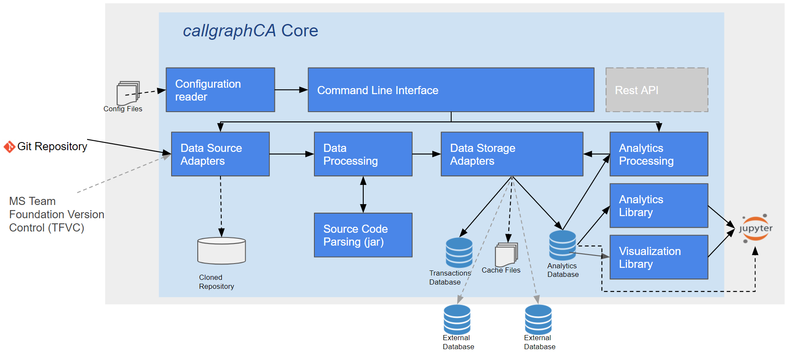

callgraphCA Architecture
---------------------

Figure "Architectural Diagram" shows the main architecture of *callgraphCA*. To start running the analysis of a git project, the user must provide a configuration file, the detailed content is explained in [Analysing new projects](<https://github.com/GLopezMUZH/call_graph_change_analyser/blob/main/docs/tutorial.rst>). For the the processing and analyzing of the project changes, *callgraphCA* contains the following subcomponents: 

* Configuration reader. The configuration reader loads the parameters from a text file and converts them into class objects callable through the application.
* Data source adapters. One of the goals is that *callgraphCA* will easily be extensible to other types of source code repositories, like SVN or Microsoft Team Foundation Version Control (TFVC) for legacy systems. This component uses repository specific libraries that are responsible for accessing and loading the source code changes from the repositories. The repository type can be set in the configuration file.
* Data Processing. The processing component generates first the version control meta-data of each commit and then processes the source code of the changed files. The process is dividied between generating the structural couplings of the file, like file and package imports, then parsing the source code to get the function or method calls, getting the functions or methods of each file, and finally generating the call graph for each commit. Depending on the language of the project, different parsing strategies must be employed to extract the relevant change data, currently *callgraphCA* is working for Java projects. When the generation of the version and structural data is done, *callgraphCA* analyzes this data and saves the call graph changes for each commit as well as statistics. 
* Storage adapters. The main functionality of this component is to save the processed data of the source version control changes as well as the generated call graphs for each commit. This data is persisted in two databases, currently in SQLite within the processing machine. *callgraphCA* can be extended to save the data in different database types and locations. If the user configures it, the source code data and parsing can be saved in cache files. The advantage of persisting the information in a configurable database, is that different runs can be executed and statistics can be gathered from within the database without the need of re-processing the whole source code changes history. Another advantage is that different users can read the results and use them for their own analyis. 
* Analytics and visualization libraries. For a more user-friendly of the processed data, *callgraphCA* provides analytics and visualization libraries that can be used, for example in Jupyter Notebooks for the display of different results of the project analysis. 
