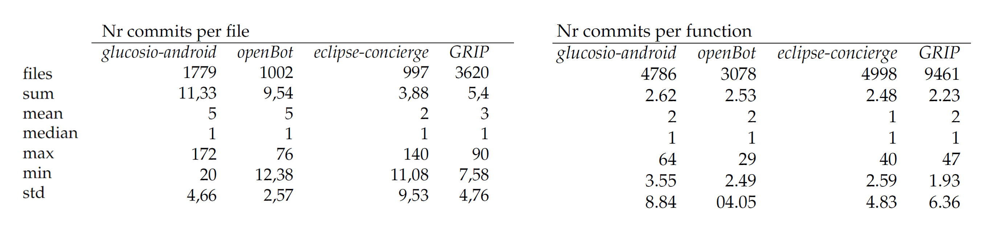
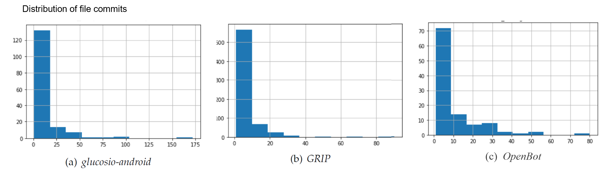
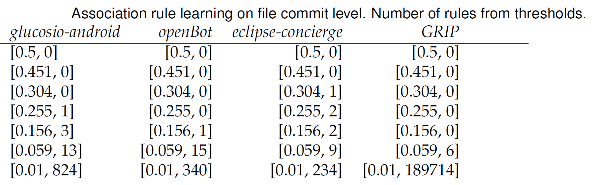
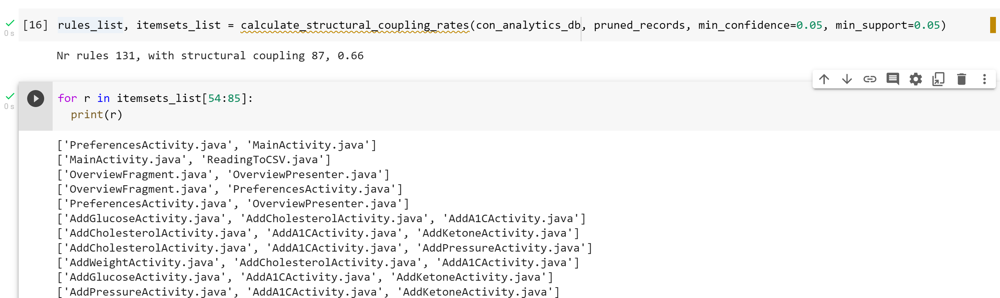
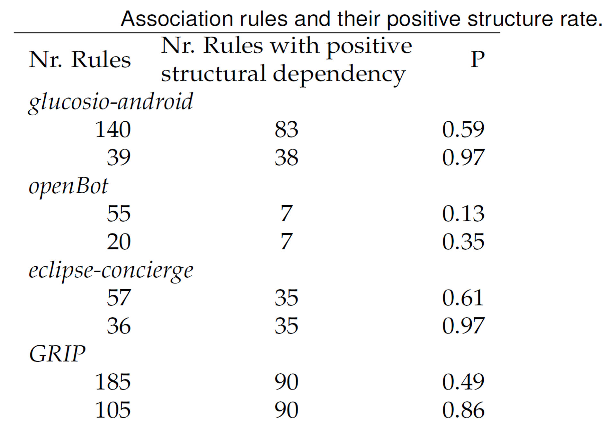
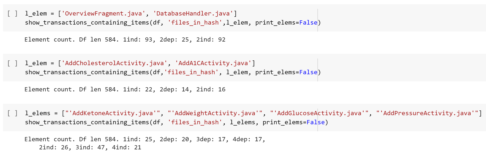

Research results
---------------------
The development of *callgraphCA* was motivated by the following research questions:

* RQ1: To what extent is it possible to build evolutionary call-graphs based on software version management information?
* RQ2: What is the relation between structural coupling (on a function level) and the call-graphs software evolution?
* RQ3: Is there a relation between conceptual (non-structural) coupling and the call-graphs software evolution?

Additional to our goal of answering the research questions, we developed *callgraphCA* as a user-friendly tool for researchers and software development teams so that they can apply its functionality to different systems. 

We present here the empirical results when applied to our systems under study, to show how *callgraphCA* can support the understanding of sofware evolution.

Change proneness
---------------------
Before the introduction of the term change coupling by Fluri et al., in 2003, Bieman et al. [^107] pointed out that frequent changes in clusters of classes might reflect functional coupling or chronic problems in the architecture of the system; both Nagappan et al. [^108] and D’Ambros et al. [^40] found that change proneness correlates stronger that coupling in the projects they studied back then.
In Table t.1 we summarize the results of the change proneness trough out the life of the systems under study. For a visual aid, in Figure f.1 we show the distribution of number of commits per file for the projects glucosio-android, GRIP and OpenBot.The skewed distribution comes from the many files changing rarely, and very few files who are often updated, this distribution is similarly present in all of our projects: Over 80% of the changes happen in less than 40% of the files or functions in the system. These results align with previous research, that has found that many social artifacts, like social and economical networks, present long tailed behaviours with scarce matrices. 

The identification of co-change patterns in complex systems with such exponential behaviours is not a task for intuitive pattern detection and needs support from appropriate tools.

Change coupling
---------------------
Association rule mining is a process to find frequent associations. In *callgraphCA* we use the algorithm "apriori" to discover association rules. This algorithm requires thresholds for a minimum *support* to find the frequent itemsets. Optionally, a minimum *confidence* that sets the minimum conditional probability  . It is necesary to adjust between high thresholds, that eliminate loose relations but reduce the number of rules to small sets that might be not actionable, or lower thresholds where much association rules are found, with low support that the user finds them irrelevant. In the following Table we display the amount of generated rules for a range of thresholds.

In the following image we show the function `calculate_structural_coupling_rates`. This function finds asociation rules in the given set of transactions that fullfil the support and confidence parameters, additionally to the list of itemsets, it displays the total number of rules and how many of them include items that are structurally coupled. 

In the Table "Association rules and positive structural dependency rate" we show, in the first column the number of rules found with a threshold of 0.02. The second column presents the number of rules with itemsets that present a structural dependency. There are two rows for each project; the first shows rules generated including all itemsets, the second row shows the numbers having itemsets larger than two. 

With the function `show_transactions_containing_items` the user can know the number of occurrences of each of the rule’s items within the set of transactions. It shows the number of times that the items existed in the transactions set. It explains the *'ind'* individual times that the item appears and, additioally, it explains the directional
number of occurrences where the first item is the predecesor to the next, and so forward until the last item.

Call graph evolution
---------------------

|                           | nr. nodes |      | nr. edges |      | growth rate |       | diameter |     |
|---------------------------|-----------|------|-----------|------|-------------|-------|----------|-----|
|                           | start     | end  | start     | end  | nodes       | edges | start    | end |
| Glucosio/glucosio-android |        24 | 1004 |        21 | 1608 |        41,8 |   1,6 |        1 |   6 |
| eclipse/concierge         |       840 | 1579 |      1373 | 3066 |         1,9 |   1,9 |       24 |  24 |
| isl-org/OpenBot           |       251 |  783 |       328 | 1207 |         3,1 |   1,5 |        7 |   8 |
| WPIRoboticsProjects/GRIP  |      1553 | 2602 |      2684 | 6285 |         1,7 |   2,4 |        8 |   9 |

[^107]: J. Bieman, A. Andrews, and H. Yang, “Understanding change-proneness in oo software through visualization,” in 11th IEEE InternationalWorkshop on Program Comprehension, 2003.,pp. 44–53, 2003.
[^108]: N. Nagappan and T. Ball, “Static analysis tools as early indicators of pre-release defect density,” in Proceedings of the International Conference on Software Engineering (ICSE), pp. 580–586, 2005.
[^40]: M. D’Ambros, M. Lanza, and R. Robbes, “On the relationship between change coupling and software defects,” in 2009 16th Working Conference on Reverse Engineering, pp. 135–144, 2009.
[^101]: G. Bavota, B. Dit, R. Oliveto, M. Di Penta, D. Poshyvanyk, and A. De Lucia, “An empirical study on the developers’ perception of software coupling,” in 2013 35th International Conference on Software Engineering (ICSE), pp. 692–701, 2013.
[^93] N. Ajienka, A. Capiluppi, and S. Counsell, “An empirical study on the interplay between semantic coupling and co-change of software classes,” Empir. Softw. Eng., vol. 23, pp. 1791–1825, June 2018.
